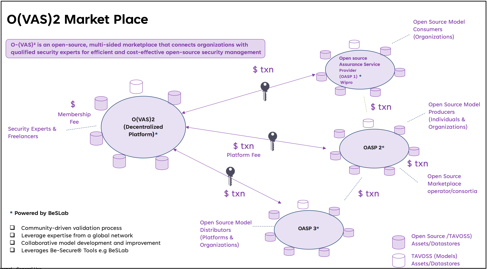

# OSSVerse (Open Source Market place)

OSSVerse is an open source Marketplace. It is conceptualized as an eco system project comprising of multiple platforms. It is an adaptation of ONDC and Beckn protocol for open source software service delivery . OSSVerse leverages BeSecure(BeS) for delivering open source software security assurance services . OSSVerse aims to establish an open network of OASPs for businesses that will offer trustworthy and reliable open source software assurance services.

## Why an Open source Marketplace..

### State of open source in enterprise.

The widespread adoption of OSS (open source software) across industries has brought immense innovation but also unique security challenges. 
One of the barriers to OSS adoption is the lack of Trust.
Many organizations lack internal expertise to effectively assure and remediate open-source models, creating a demand for external services such as Open-source Assurance Service Providers (OASP).
Organizations require  timely support for open-source models, datasets, and projects. 

#### Consideration while adopting an Open source first Strategy
- Supply chain & Security Risks​
- Limited Control and support​
- Forking Costs​
- Incomplete Security​, Uncertain Reliability​
- Fragmented Knowledge​

## Solution to the problem
A Trustworthy Marketplace for Open-Source Assurance Service Providers (OASP) backed by a thriving open-source security community. Affordable and timely access to vendor neutral security services for organizations producing and consuming open-source. OASP led open source assurance service delivery would give full control over their  open source components

## Key benefits to the enterprise client
OSS Consumers:
- Trustworthy Marketplace
- Access Affordable & prompt Vendor-Neutral Security Services
- Timely Support
- Full Control

OSS Producers:
- Enhanced Trust and Credibility
- Marketability
- Compliance and Standards
- Competitive Advantage
- Quality Assurance
- Legal Protection

## Key Stakeholders
1. Open Source Model Producers (Individuals & Organizations)
    - Create and share open source models
2. Open Source Model Consumers (Organizations)
    - Consume and request for assurance services of open source models 
3. Open Source Model Distributors (Platforms & Organizations)
    - Distribute the sharing of open-source models along with the proof of attestation of models OASP
4. Open Source Marketplace operator/consortia
    - Deploys people resources to maintain and operate marketplace and responsible for  the governance marketplace
5. Open Source Assurance Service Provider (OASP)
    - Provide Validation, Verification, Attestation & Support Service
    - Set up dedicated remediated pipelines for organizations
    - Validate models, create model cards & ensure quality/security
6. Security Experts & Freelancers
    - Offering open-source security assessments and support services

# FAQs on Registering and Evaluating OASPs in OSSVerse

##1. How do I register the first OASP when there are no OASPs registered?##

Any organization or business interested in becoming an Open Source Assurance Provider (OASP) can initiate the registration process to join the OSSVerse open network. However, actual participation as an OASP is contingent upon the issuance of an OASP license. The process of registration effectively refers to the application for an OASP license. OSSVerse facilitates the issuance of OASP licenses for specific Projects of Interest (PoI) or Models of Interest (MoI) or their categories through dedicated OASP License Issuance Services. Initially, this service is provided directly by OSSVerse but may later be delegated to other ecosystem partners within the OSSVerse network who specialize in OASP license issuance and renewals.
To encourage organizations that have developed their own Open Source Software (OSS) projects to become OASPs for the OSS they have curated or seeded, OSSVerse highlights the potential monetary benefits. These benefits include remuneration for providing OSS security assurance and other support services. Additionally, OSSVerse incentivizes these organizations to engage in Assessment & Attestation services for technology PoIs and MoIs similar to their own, enhancing the verification and validation process within the network.

##2.How is the evaluation done when there are no OASPs with the capability to assess, despite having many registered OASPs?##

In situations where the registered OASPs do not possess the skills or Projects of Interest (PoI) or Models of Interest (MoI) matching those required by a prospective OASP, the selection process becomes more open. The opportunity to curate a new BeSecure (BeS) Environment & BeS Playbook and to obtain an OASP license will be awarded to the entity that can do so at the lowest cost. It is essential for the OASP to indicate their openness to projects or models outside their current PoI and MoI and to apply for an OASP License for the new PoI or MoI as part of their service request. The additional costs associated with obtaining an OASP license can either be included in the service request or covered by the aspiring OASP. This approach ensures that even when existing OASPs lack certain capabilities, there remains a pathway for new and capable entities to join the OSSVerse as OASPs, thereby maintaining the network's growth and diversity.
